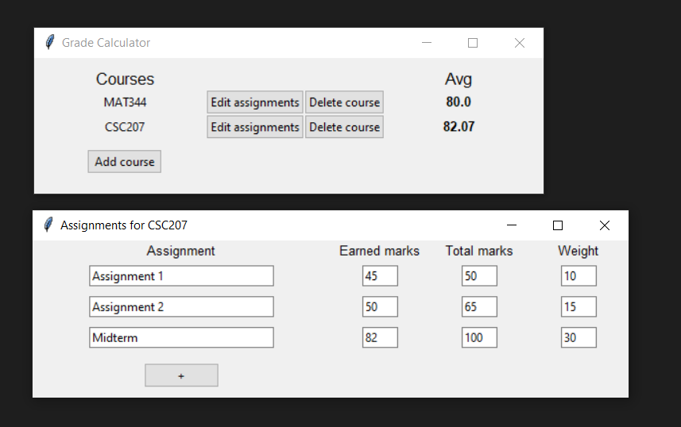

# grade_calculator

A simple grade calculator that calculates and tracks the grades of your courses throughout a school year.

### Usage

All required modules are included in the Python standard library.

To use the grade calculator, run

```sh
python interface.py
```



Courses can be added and removed. Each course also has an associated list of assignments, where you can record the earned marks, total marks, and weight of each assignment for the course.

The course averages of each course are calculated as a weighted average of the assignments in the course's assignments list, taking into account the weight of each assignment.

The courses and assignments are stored locally in a database file, so they can be accessed when the grade calculator is opened again at a later time. This allows for assignments and courses to be continuously updated, say, throughout a school year.

### License

Distributed under the MIT License. More information can be found in `LICENSE`.
